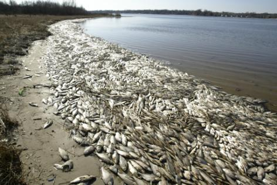
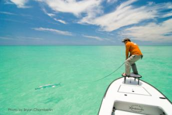
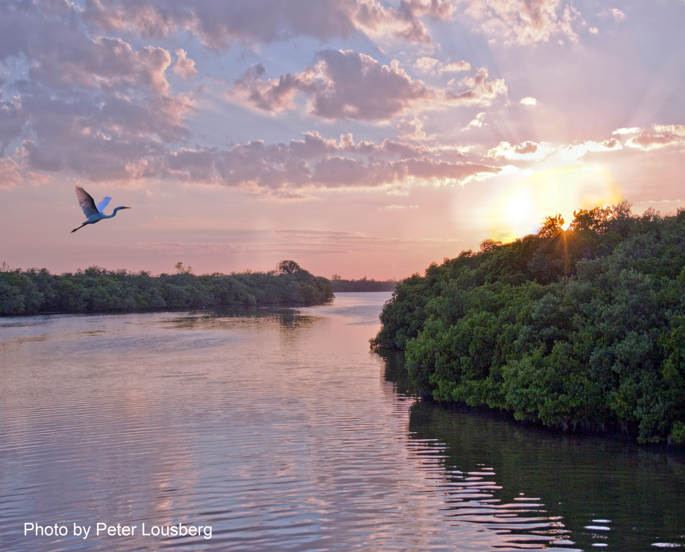
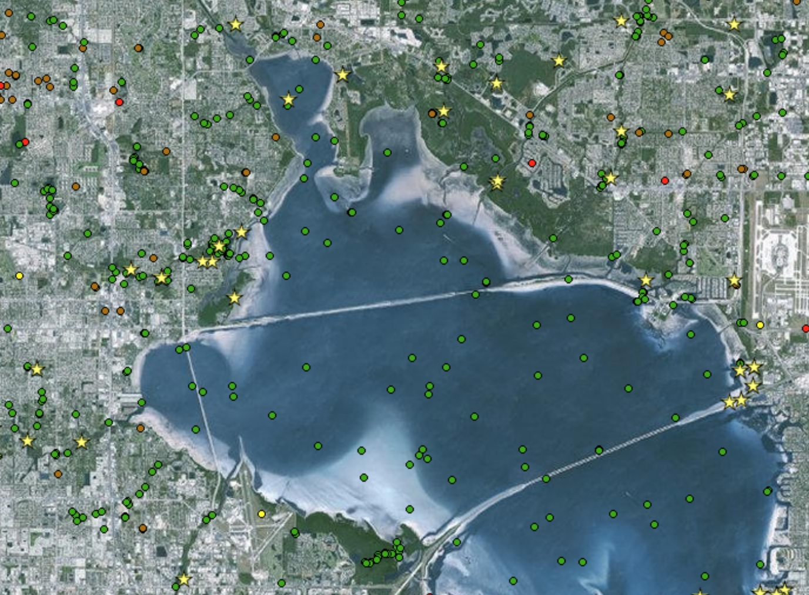

Use of prior knowledge to inform restoration projects in estuaries of GOM
========================================================
author: Beck, Varela, Sherwood, Ireland, Dorans, Henkel - in no particular order
date: July 14, 2017
autosize: true

Tampa Bay was gross
========================================================

Tampa Bay was gross
========================================================

Tampa Bay is not as gross
========================================================

Tampa Bay is not as gross
========================================================

Tampa Bay is not as gross
========================================================

But how much less gross??
========================================================

But how much less gross??
========================================================

